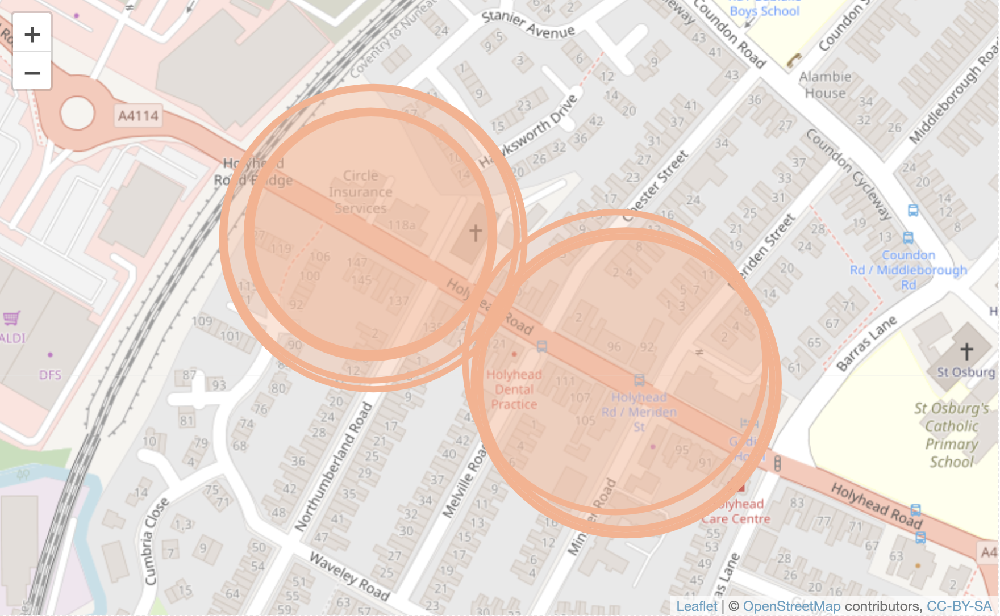
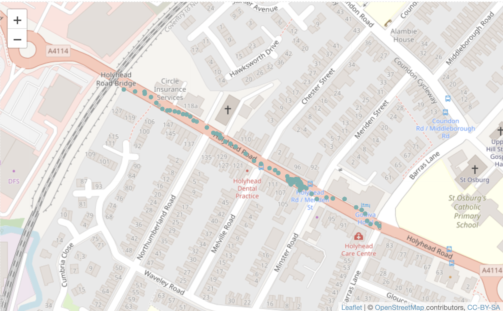
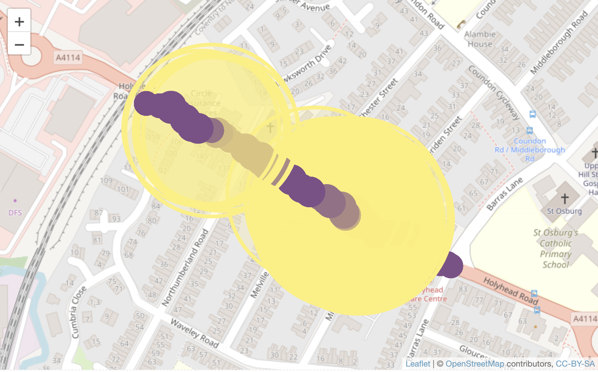

## Mapping

Mapping of WiFi signals to show how the road is subdivided.

Map of Bluetooth signals linked to the WiFi signals.

Map of Bluetooth signals linked to the WiFi signals. Yellow circles are the WiFi with the Bluetooth in purple. The Bluetooth signals are made smaller to see the relationships.

